## Escuela Colombiana de Ingeniería
### Arquitecturas de Software – ARSW
### Diego Leon


#### Ejercicio – programación concurrente, condiciones de carrera y sincronización de hilos. EJERCICIO INDIVIDUAL O EN PAREJAS.

##### Parte I – Antes de terminar la clase.

Control de hilos con wait/notify. Productor/consumidor.

1. Revise el funcionamiento del programa y ejecútelo. Mientras esto ocurren, ejecute jVisualVM y revise el consumo de CPU del proceso correspondiente. A qué se debe este consumo?, cual es la clase responsable?
   
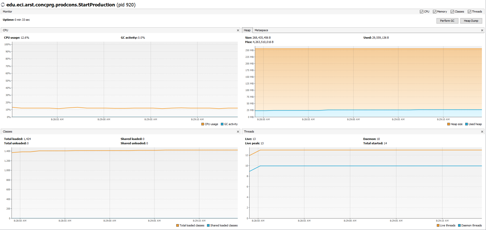

Se puede apreciar un alto consumo de CPU debido a la clase Producer que se encarga de generar los objetos e insertarlos a la lista queue para que el consumidor pueda sacarlos de la misma, el problema se encuentra en que el consumidor no tiene pausa mientras que el productor si de un segundo, asi, el productor necesita suplir la cantidad necesaria de objetos para el consumidor lo que genera un alto consumo de CPU.

2. Haga los ajustes necesarios para que la solución use más eficientemente la CPU, teniendo en cuenta que -por ahora- la producción es lenta y el consumo es rápido. Verifique con JVisualVM que el consumo de CPU se reduzca.

Para solucionar el consumo alto de CPU lo que hacemos es hacer que el consumidor descanse el mismo tiempo que el productor para que sea mas lo que se produce que lo que se consume. Siendo asi se baja el consumo de CPU a un nivel significativo.

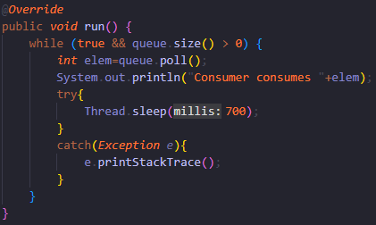   

Podemos apreciar que se redujo el consumo de CPU notablemente una vez se ha hecho el cambio en la clase Consumer.

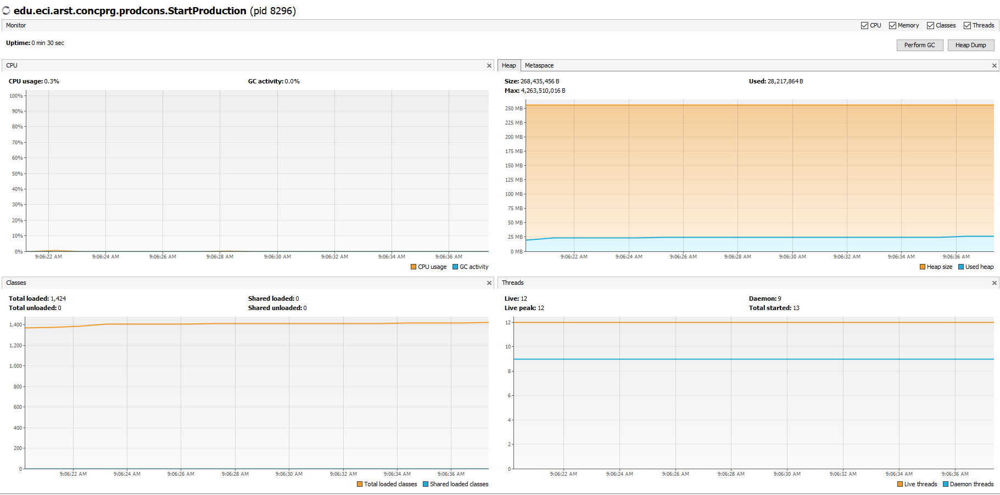

3. Haga que ahora el productor produzca muy rápido, y el consumidor consuma lento. Teniendo en cuenta que el productor conoce un límite de Stock (cuantos elementos debería tener, a lo sumo en la cola), haga que dicho límite se respete. Revise el API de la colección usada como cola para ver cómo garantizar que dicho límite no se supere. Verifique que, al poner un límite pequeño para el 'stock', no haya consumo alto de CPU ni errores.

Para garantizar que el productor produzca mas rapido de lo que el consumidor consume vamos a modificar el tiempo en el que el hilo descansa disminuyendo su valor y aumentando el del consumidor. Asimismo, hacemos uso de syncroniced para que en el momento que el productor haya producido el limite que tiene entonces sincronice los hilos para parar la insercion de objetos en queue haciendo uso de wait() para garantizar lo mencionado.

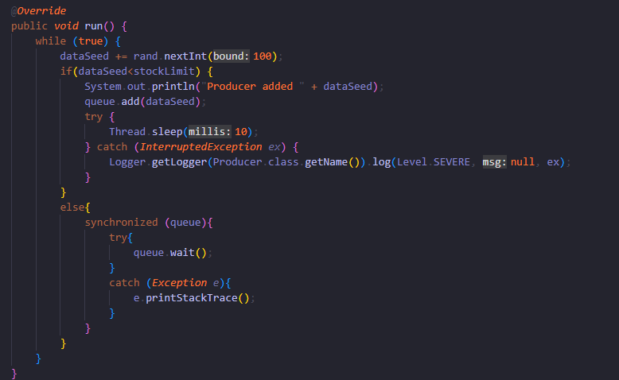

Para que no se generen errores al superarse el limite del API de la coleccion vamos a ponerle limite al stock que puede producir la clase Producer.

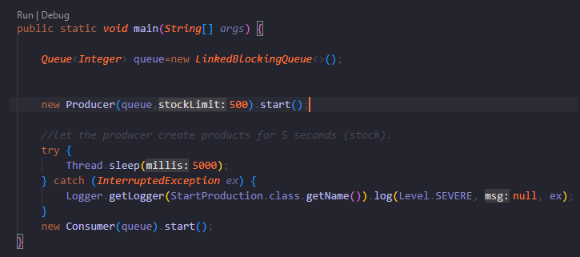

Se puede apreciar que el consumo de CPU es menos del 0,1% siendo excaso el consumo.

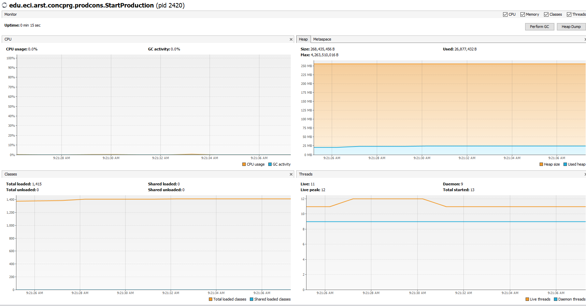

##### Parte II. – Antes de terminar la clase.

Teniendo en cuenta los conceptos vistos de condición de carrera y sincronización, haga una nueva versión -más eficiente- del ejercicio anterior (el buscador de listas negras). En la versión actual, cada hilo se encarga de revisar el host en la totalidad del subconjunto de servidores que le corresponde, de manera que en conjunto se están explorando la totalidad de servidores. Teniendo esto en cuenta, haga que:

- La búsqueda distribuida se detenga (deje de buscar en las listas negras restantes) y retorne la respuesta apenas, en su conjunto, los hilos hayan detectado el número de ocurrencias requerido que determina si un host es confiable o no (_BLACK_LIST_ALARM_COUNT_).
- Lo anterior, garantizando que no se den condiciones de carrera.

Para garantizar que se cumpla que se detenga las busquedas se hace uso de synchronized para que al momento de que se verifique que la ip esta en una lista negra deje de buscar en las demas sino retorne "As Not Trustworthy" y detenga los demas hilos.

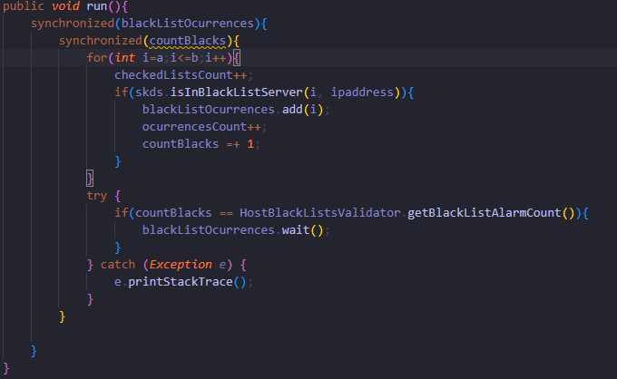

Asimismo, sobreescribimos el metodo checkHost para recibir ademas del parametro ipaddress el de numero de hilos para la creacion de los mismos. En donde hacemos que se detengan los hilos una vez se haya encontrado que la ip es "As Not Trustworthy"

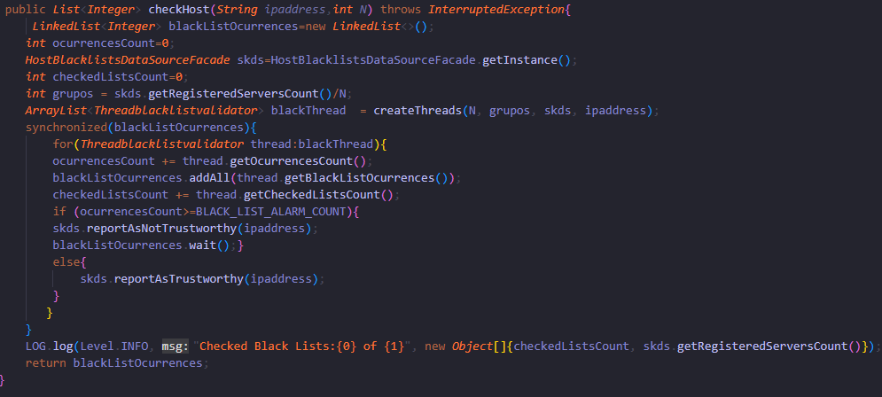

##### Parte III. – Avance para el martes, antes de clase.

Sincronización y Dead-Locks.


1. Revise el programa “highlander-simulator”, dispuesto en el paquete edu.eci.arsw.highlandersim. Este es un juego en el que:

	* Se tienen N jugadores inmortales.
	* Cada jugador conoce a los N-1 jugador restantes.
	* Cada jugador, permanentemente, ataca a algún otro inmortal. El que primero ataca le resta M puntos de vida a su contrincante, y aumenta en esta misma cantidad sus propios puntos de vida.
	* El juego podría nunca tener un único ganador. Lo más probable es que al final sólo queden dos, peleando indefinidamente quitando y sumando puntos de vida.

2. Revise el código e identifique cómo se implemento la funcionalidad antes indicada. Dada la intención del juego, un invariante debería ser que la sumatoria de los puntos de vida de todos los jugadores siempre sea el mismo(claro está, en un instante de tiempo en el que no esté en proceso una operación de incremento/reducción de tiempo). Para este caso, para N jugadores, cual debería ser este valor?.

Se crea un boton Start en la clase ControlFrame en donde al ser pulsado va a inicializar la creacion de los inmortales dependiendo del numero de inmortales que haya indicado el usuario. Una vez creada la lista de inmortales se hace la verificacion de que no sea nula la lista y se da comienzo a cada hilo.

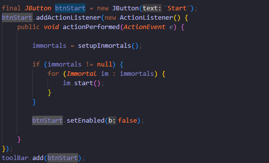

En la misma clase se crea la lista de inmortales en donde recibe el numero de inmortales indicado por el usuario y comienza la creacion de cada objeto de tipo Inmortal enviando sus respectivos atributos teniendo que la vida y el daño es un valor fijo (La vida es cambiante una vez se corre el programa mientras que el daño no cambia).

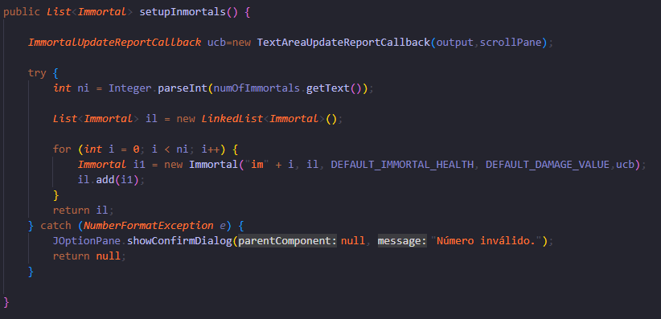

En la clase inmortal se va a dar la pelea entre inmortales sin antes verificar que un inmortal no puede pelearse contra el mismo. Al generarse la pelea entre dos inmortales se le va a restar vida a uno mientras que al otro se le suma.

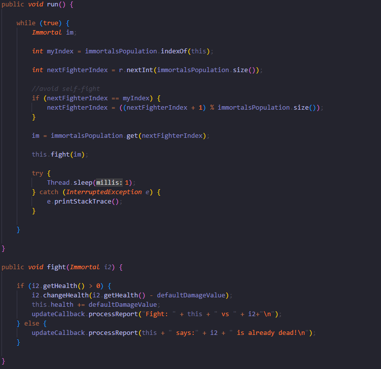

Para N jugadores debe haber N * 100 de vida

3. Ejecute la aplicación y verifique cómo funcionan las opción ‘pause and check’. Se cumple el invariante?.

No se cumple el invariante debido a que en este caso al ser 5 Inmortals y teniendo en cuenta que la ecuacion es N * 100 tendria que ser la vida 500.


4. Una primera hipótesis para que se presente la condición de carrera para dicha función (pause and check), es que el programa consulta la lista cuyos valores va a imprimir, a la vez que otros hilos modifican sus valores. Para corregir esto, haga lo que sea necesario para que efectivamente, antes de imprimir los resultados actuales, se pausen todos los demás hilos. Adicionalmente, implemente la opción ‘resume’.

Modificamos el boton "Pause and Check" haciendo uso de synchronized para sincronizar los hilos y que al momento de darle al boton nuestros hilos sean pausados. Asimimos, sincronizamos im.getHealth() para garantizar que no se modifique mientras queremos consultar el valor para imprimir. Para este caso cambiamos el tipo de variable de sum de int a AtomicInteger debido a  que este tipo de variable nos permite realizar operaciones en un contexto multihilo sin la necesidad de usar syncronized. 


En nuestra clase Inmortal vamos a modificar el run haciendo uso de synchronized para sincronizar nuestra lista de inmortals. Ademas, vamos a hacer la condicion que si la bandera paused esta verdadera entonces pausamos el hilo.


Para terminar modificamos el metodo fight de la misma clase para sincronizar la salud de cada objeto de tipo Inmortal por lo que a su vez sincronizamos nuestra lista de inmortals. (Como hacemos uso del tipo AtomicInteger la manera en la que se suma y resta cambia por lo que hay que recurrir a metodos de la clase del mismo)


Para la implementaciond el boton resume vamos a sincronizar nuestros hilos y a cada uno le cambiamos el valor de la bandera paused a falso. Dichon cambio lo hacemos en la clase Inmortal en el metodo resumee(). Por ultimo le notificamos a todos los hilos para que siga su funcionamiento.


5. Verifique nuevamente el funcionamiento (haga clic muchas veces en el botón). Se cumple o no el invariante?.

Si se cumple el invariante N *100 que para este caso es (5 * 100)


6. Identifique posibles regiones críticas en lo que respecta a la pelea de los inmortales. Implemente una estrategia de bloqueo que evite las condiciones de carrera. Recuerde que si usted requiere usar dos o más ‘locks’ simultáneamente, puede usar bloques sincronizados anidados:

	```java
	synchronized(locka){
		synchronized(lockb){
			…
		}
	}
	```

7. Tras implementar su estrategia, ponga a correr su programa, y ponga atención a si éste se llega a detener. Si es así, use los programas jps y jstack para identificar por qué el programa se detuvo.

8. Plantee una estrategia para corregir el problema antes identificado (puede revisar de nuevo las páginas 206 y 207 de _Java Concurrency in Practice_).

9. Una vez corregido el problema, rectifique que el programa siga funcionando de manera consistente cuando se ejecutan 100, 1000 o 10000 inmortales. Si en estos casos grandes se empieza a incumplir de nuevo el invariante, debe analizar lo realizado en el paso 4.

10. Un elemento molesto para la simulación es que en cierto punto de la misma hay pocos 'inmortales' vivos realizando peleas fallidas con 'inmortales' ya muertos. Es necesario ir suprimiendo los inmortales muertos de la simulación a medida que van muriendo. Para esto:
	* Analizando el esquema de funcionamiento de la simulación, esto podría crear una condición de carrera? Implemente la funcionalidad, ejecute la simulación y observe qué problema se presenta cuando hay muchos 'inmortales' en la misma. Escriba sus conclusiones al respecto en el archivo RESPUESTAS.txt.
	* Corrija el problema anterior __SIN hacer uso de sincronización__, pues volver secuencial el acceso a la lista compartida de inmortales haría extremadamente lenta la simulación.

11. Para finalizar, implemente la opción STOP.

<!--
### Criterios de evaluación

1. Parte I.
	* Funcional: La simulación de producción/consumidor se ejecuta eficientemente (sin esperas activas).

2. Parte II. (Retomando el laboratorio 1)
	* Se modificó el ejercicio anterior para que los hilos llevaran conjuntamente (compartido) el número de ocurrencias encontradas, y se finalizaran y retornaran el valor en cuanto dicho número de ocurrencias fuera el esperado.
	* Se garantiza que no se den condiciones de carrera modificando el acceso concurrente al valor compartido (número de ocurrencias).


2. Parte III.
	* Diseño:
		- Coordinación de hilos:
			* Para pausar la pelea, se debe lograr que el hilo principal induzca a los otros a que se suspendan a sí mismos. Se debe también tener en cuenta que sólo se debe mostrar la sumatoria de los puntos de vida cuando se asegure que todos los hilos han sido suspendidos.
			* Si para lo anterior se recorre a todo el conjunto de hilos para ver su estado, se evalúa como R, por ser muy ineficiente.
			* Si para lo anterior los hilos manipulan un contador concurrentemente, pero lo hacen sin tener en cuenta que el incremento de un contador no es una operación atómica -es decir, que puede causar una condición de carrera- , se evalúa como R. En este caso se debería sincronizar el acceso, o usar tipos atómicos como AtomicInteger).

		- Consistencia ante la concurrencia
			* Para garantizar la consistencia en la pelea entre dos inmortales, se debe sincronizar el acceso a cualquier otra pelea que involucre a uno, al otro, o a los dos simultáneamente:
			* En los bloques anidados de sincronización requeridos para lo anterior, se debe garantizar que si los mismos locks son usados en dos peleas simultánemante, éstos será usados en el mismo orden para evitar deadlocks.
			* En caso de sincronizar el acceso a la pelea con un LOCK común, se evaluará como M, pues esto hace secuencial todas las peleas.
			* La lista de inmortales debe reducirse en la medida que éstos mueran, pero esta operación debe realizarse SIN sincronización, sino haciendo uso de una colección concurrente (no bloqueante).

	

	* Funcionalidad:
		* Se cumple con el invariante al usar la aplicación con 10, 100 o 1000 hilos.
		* La aplicación puede reanudar y finalizar(stop) su ejecución.
		
		-->

<a rel="license" href="http://creativecommons.org/licenses/by-nc/4.0/"></a><br />Este contenido hace parte del curso Arquitecturas de Software del programa de Ingeniería de Sistemas de la Escuela Colombiana de Ingeniería, y está licenciado como <a rel="license" href="http://creativecommons.org/licenses/by-nc/4.0/">Creative Commons Attribution-NonCommercial 4.0 International License</a>.
